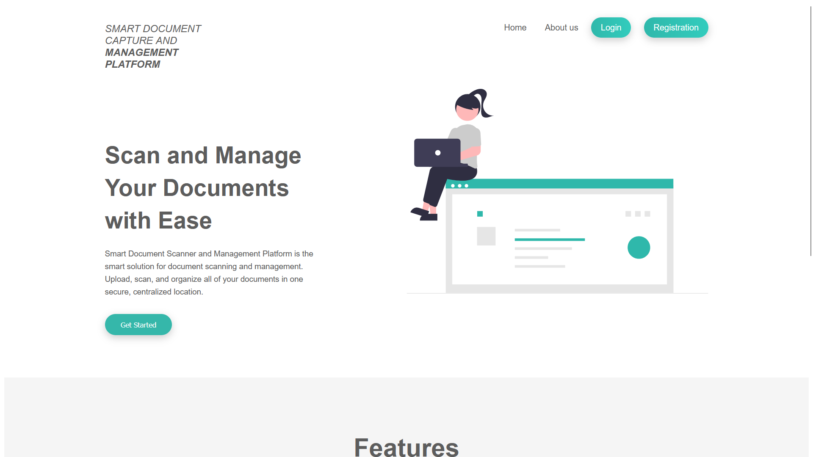

# SmartDoc

SmartDoc is a smart document management platform built with Spring Boot. It provides users with the ability to register and sign in to manage their records required by their organization and more. Users can update their password, update their profile picture, upload and categorize documents, and download them as needed.

The project uses MySQL as the backend database to store all the information, including user details and their files. Passwords are encrypted using bcrypt, ensuring secure storage and authentication. Spring Security has been implemented to provide authentication and authorization features.

## Features

- User Registration and Sign-in: Users can register an account and sign in to access the platform.
- Password Management: Users can update their password and use the forgot password functionality on the login page if needed.
- Profile Picture Update: Users can update their profile picture to personalize their account.
- Document Upload and Categorization: Users can upload documents and categorize them for easy organization and retrieval.
- Document Download: Users can download the uploaded documents as required.
- Admin Dashboard: The admin has access to a dashboard with additional functionalities.
- User Information Management: The admin can view and download information for all users.
- Faculty Data: The admin can access and manage faculty data, including major details.
- Search Functionality: The admin can search for users by email or faculty department.
- CSV Export: The admin can export user information as a CSV file for further analysis.
- User Profile Details: The admin can click on a specific user to view their detailed profile information.

## Installation

1. Clone the repository:

```bash
git clone https://github.com/username/SmartDoc.git
```

2. Navigate to the project directory:

```bash
cd SmartDoc
```

3. Configure the MySQL database connection in the `application.properties` file:

```properties
spring.datasource.url=jdbc:mysql://localhost:3306/smartdoc
spring.datasource.username=your-username
spring.datasource.password=your-password
```

4. Build and run the project using Maven:

```bash
mvn spring-boot:run
```

5. Access the application in your web browser at `http://localhost:8080`.

## Usage

1. Register an account or sign in if you already have one.
2. Use the provided functionalities to manage your documents and profile.
3. If you are an admin, access the admin dashboard to manage user information and perform searches.
4. Download and categorize documents as needed.
5. Explore user profiles and download their information or documents.
6. Enjoy using SmartDoc for smart document management!

## Contributing

Contributions are welcome! If you have any ideas, suggestions, or bug reports, please open an issue on the [GitHub repository](https://github.com/vvswps/SmartDoc/issues).

## License

This project is licensed under the [MIT License](LICENSE).

## Acknowledgements

We would like to extend a special acknowledgment to [Tanu22srivastava](https://github.com/Tanu22srivastava) for their invaluable contributions to the development of this project. Their dedication, expertise, and hard work have greatly contributed to the success of the SmartDoc application. We appreciate their collaboration and commitment to delivering a high-quality product.

Thank you, [Tanu22srivastava](https://github.com/Tanu22srivastava), for being a great contributor to this project!

[](https://youtu.be/-ilnUizvMlw)
